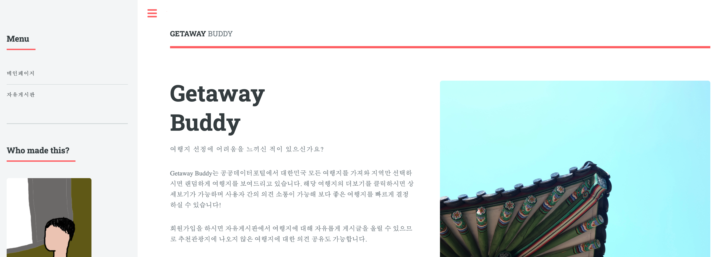
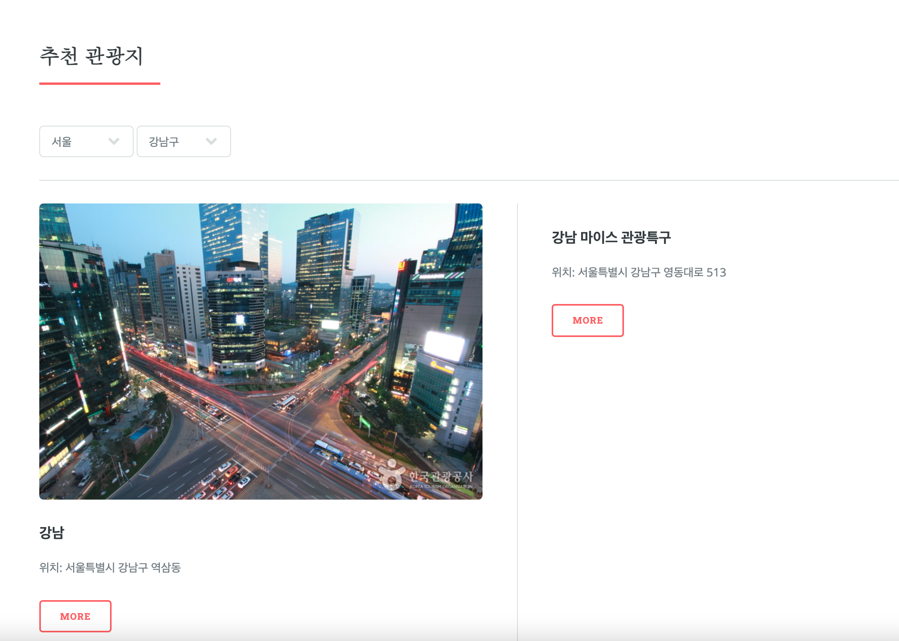
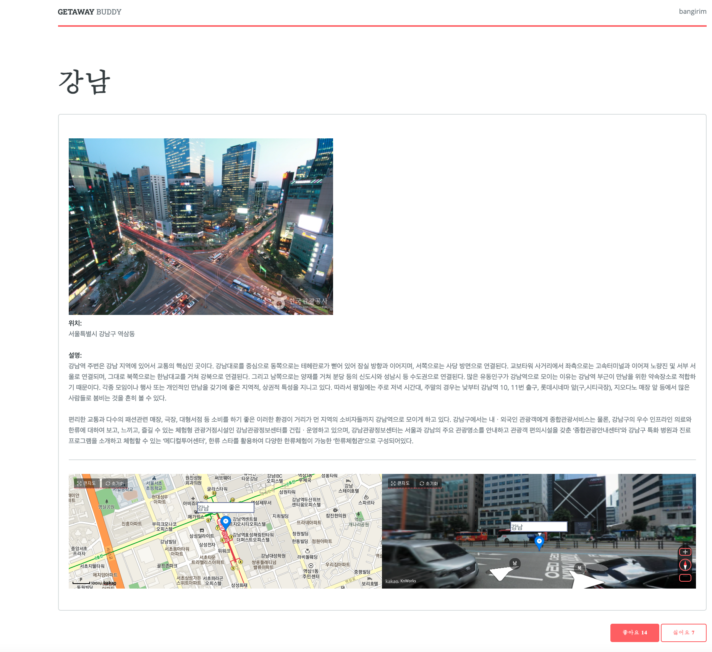
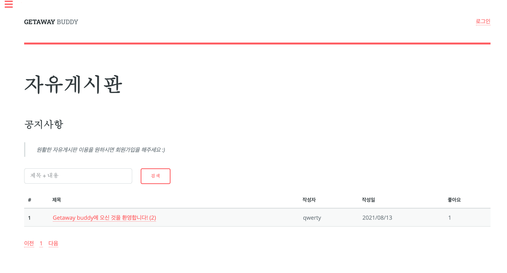
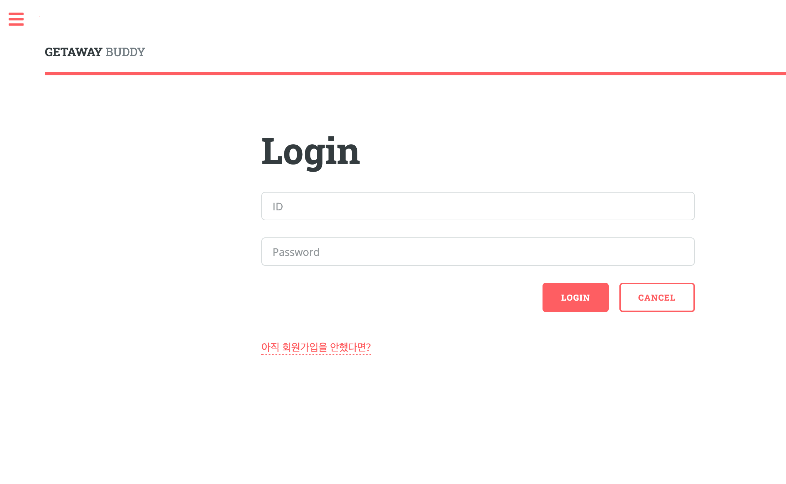
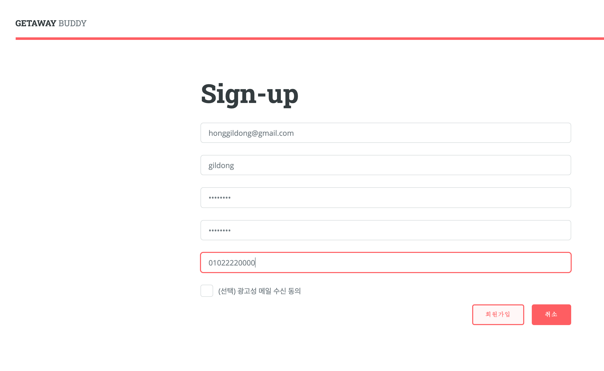
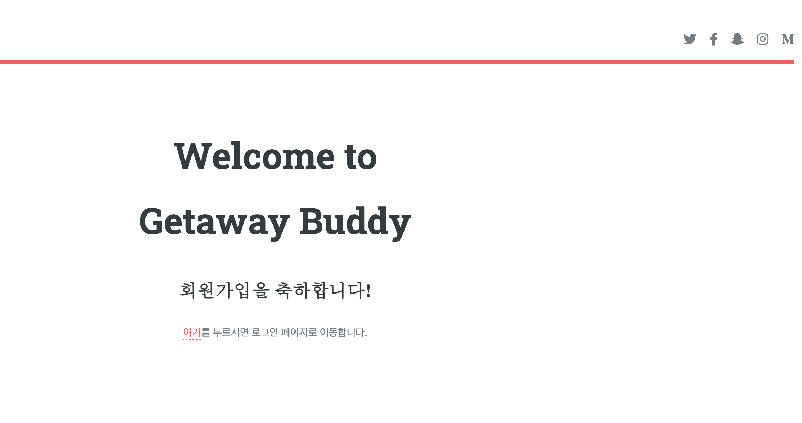
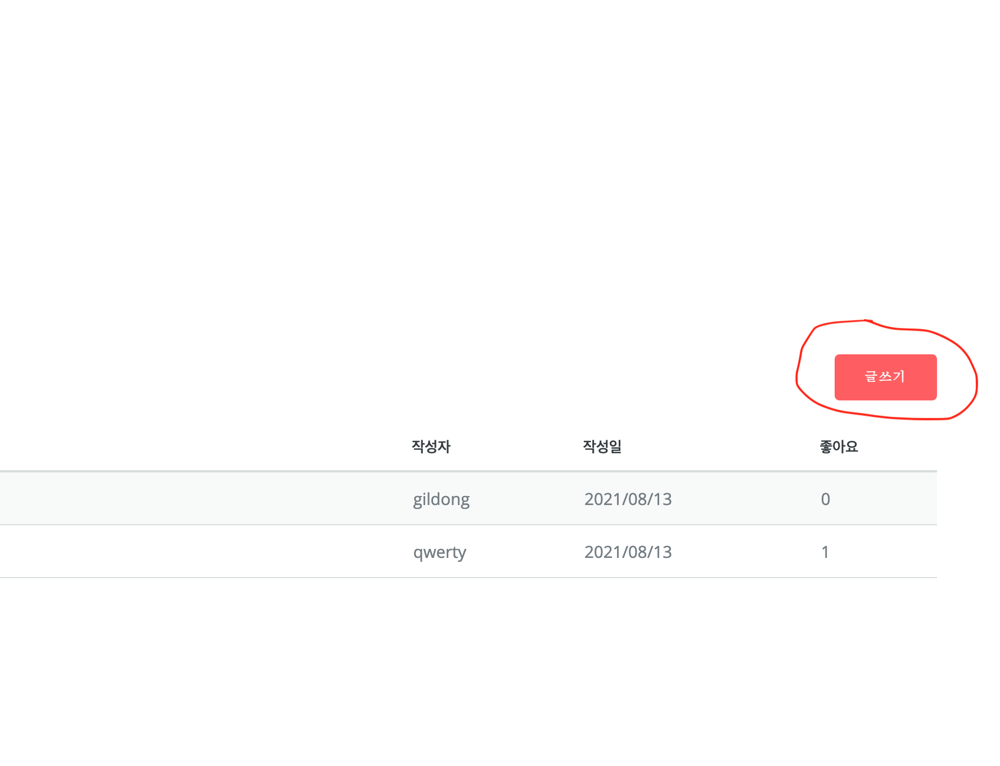
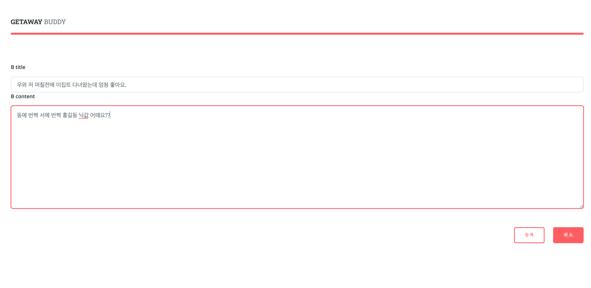
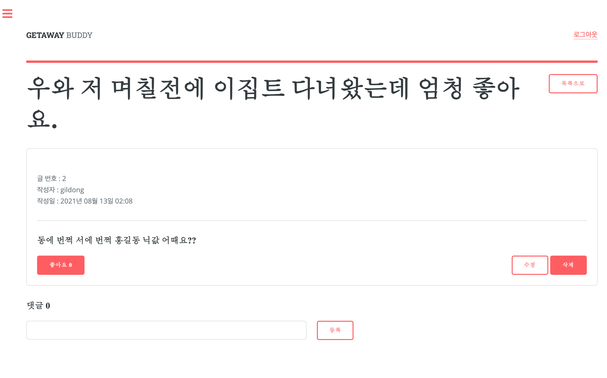

# GETAWAY BUDDY

---

안녕하세요 🙋‍♂️ 🙋‍♀️ 

**Getaway**는 '여행'이라는 뜻을 가진 단어에요 :) 

상상만 해도 좋지 않나요?? 🏝 

저는 보통 시험 끝났을 때, 또는 어떤 무언가 크고 귀찮았던 일들을 해결했을 때 많이 사용했던 말 같아요. 

이를 테면, 시험이 끝났다면 **post-exam getaway** 라고 말하며 친구들과 이집트로 떠난 기억이 나네요ㅎㅎ 

지금 만든 페이지는 Django를 이용한 Web Programming Project의 일환으로 만들었어요. 상용화 목적보다는 개인 기술 응용 및 이해도를 높이는데 중점을 두고 만들었죠ㅎㅎ 

그럼 한번 살펴 보실까요??

## 메인 페이지

## 추천 관광지

​      **`MORE`** 버튼을 꾹 누른다면:

Kakao 지도 api를 이용해서 지도를 구현해보았습니다. 🗺 

`좋아요`와 `싫어요` 기능도 `.ajax ` 를 통해 처리해보았어요ㅎㅎ 

## 자유게시판 기능

많은 유저들과 여행에 대한 원활한 정보 공유를 위해 자유게시판도 구현해보았는데요. 

이렇게 생겼답니다ㅎㅎ

검색과 page 처리는 제가 했답니다ㅎㅎ (제일 쉬운거였음...) (`Rphabet`)

음 그나저나 글쓰기 기능이 안보이죠 왜? 

로그인을 하셔야만 글쓰기 📝 및 좋아요 👍, 댓글 💬   기능을 이용할 수 있어요.

그럼 자세한 기능을 보기전에 회원가입을 해볼까요?

우측 상단에 <u>로그인</u> 버튼을 눌러주시죠!

이렇게 화면이 떴다면, 회원가입을 꾹 눌러주세요.

이름은 홍길동이 좋겠네요. 

자 이제 홍길동이 만들어졌습니다. 

회원가입 끄읏.

다시 자유게시판으로 돌아가면 글쓰기 버튼이 새로 생겼는데요ㅎㅎ

한번 눌러보시죠.

새글 작성중...

닉네임이 홍길동인 만큼, 대한민국 정반대에 있는 아프리카 대륙의 이집트로 가보겠습니다ㅎㅎ

이제 등록 버튼을 꾹 눌러준다면...

ㅎㅎ 제가 쓴 첫 글인만큼 **좋아요**를 눌러줘야겠네요. 😝 

좋아요 실패... 😩

위에 뜨는 좋아요 실패 경고문... 읽어보니 본인이 쓴 글을 좋아요 할 수는 없다고 하네요.. 

그래서 댓글로 화를 식혀봤습니다.ㅎㅎ

 

이렇게 이번 웹프로그래밍 프로젝트를 마무리 했는데요. 

정말 재미있고 유익한 경험이었습니다. 

많은 기능을 `README` 에 글로 설명하기엔 아직 제가 준비가 되어있진 않지만.. 그래도 시간이 날 때마다 업데이트 해볼게요ㅎㅎ

이상 **Team Getaway** 였습니다.

---

프로젝트 참여자:

- [rphabet](https://github.com/rphabet/) -- 자유게시판 담당
- [winmini](https://github.com/winmini/) -- 메인페이지 및 각종 주요 기능 담당 및 **구원투수**
- [01stone](https://github.com/01stone/) -- 로그인 기능 및 웹 디자인 담당
- [Lewis911](https://github.com/Lewis911/) -- 상세 페이지 담당

